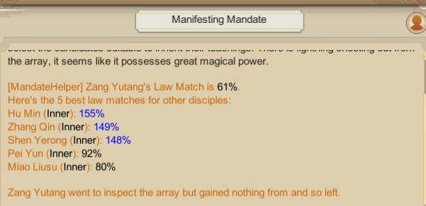

# MandateHelper
A mod for Amazing Cultivation simulator that improves the [Manifesting Mandate](<https://amazing-cultivation-simulator.fandom.com/wiki/Manifesting_Mandate>) event. Shows the Law Match of the cultivator when doing Accept Teachings, and also shows the top Law Matches among other disciples.

Example. Blue numbers indicate ≥100% matches.

## Notes
Currently it works by injecting a line of Lua code into each Manifesting Mandate event, which calls custom code exposed to Lua. No Harmony patch is involved so this should be pretty compatible.

## Compiling
If you want to compile this mod from source, make a symlink named `game` to the game's directory, so that the paths in MandateHelper.csproj are right. You may also need to modify the path to 0Harmony.dll - I use the one from ModLoaderLite. After that, it should build correctly with just `dotnet build` and deposit the mod into `bin/`.
